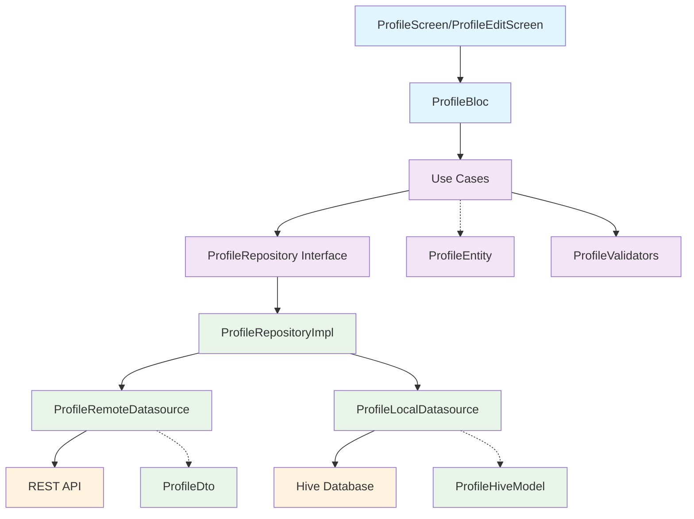

# Profile Module - Data Flow Documentation

## Overview

This document provides a comprehensive guide to the data flow in the Profile Module, explaining how data moves through each layer of the Clean Architecture implementation.

## Architecture Diagram



## Data Flow Scenarios

### 1. Load Profile Data Flow

**Trigger:** User opens profile screen or pulls to refresh

```
ProfileScreen --> ProfileBloc --> GetProfileUsecase --> ProfileRepository --> ProfileRepositoryImpl
                                                                                        ↓
                                                                            [Check local cache first]
                                                                                        ↓
                                                                            ProfileLocalDatasource --> Hive
                                                                                        ↓
                                                                            [If cache miss or expired]
                                                                                        ↓
                                                                            ProfileRemoteDatasource --> REST API
                                                                                        ↓
                                                                                [Map DTO to Entity]
                                                                                        ↓
                                                                                [Cache locally]
                                                                                        ↓
                                                                            Return ProfileEntity <-- 
ProfileScreen <-- ProfileBloc <-- GetProfileUsecase <-- ProfileRepository <-- ProfileRepositoryImpl
```

**Detailed Steps:**

1. **UI Event**: User taps refresh or screen loads
2. **BLoC Event**: `RefreshProfileRequested` emitted
3. **BLoC Handler**: Calls `GetProfileUsecase`
4. **Use Case Logic**: 
   - No validation needed for read operation
   - Calls repository interface
5. **Repository Implementation**:
   - First checks local cache via `ProfileLocalDatasource`
   - If cache hit and not expired, returns cached data
   - If cache miss, calls `ProfileRemoteDatasource`
6. **Remote Data Source**:
   - Makes GET request to `/api/profile`
   - Receives `ProfileDto` from API
7. **Data Mapping & Caching**:
   - Maps `ProfileDto` to `ProfileEntity`
   - Caches result as `ProfileHiveModel`
   - Returns entity to use case
8. **BLoC State**: Emits `ProfileState.loaded(profile)`
9. **UI Update**: Screen rebuilds with profile data

### 2. Update Profile Data Flow

**Trigger:** User saves profile changes

```
ProfileEditScreen --> ProfileBloc --> UpdateProfileUsecase --> [Frontend Validation]
                                                                        ↓
                                                              ProfileRepository --> ProfileRepositoryImpl
                                                                                            ↓
                                                                              ProfileRemoteDatasource --> REST API
                                                                                            ↓
                                                                                    [Multipart Upload]
                                                                                            ↓
                                                                                [Map response to Entity]
                                                                                            ↓
                                                                                [Update local cache]
                                                                                            ↓
ProfileEditScreen <-- ProfileBloc <-- UpdateProfileUsecase <-- ProfileRepository <-- ProfileRepositoryImpl
```

**Detailed Steps:**

1. **UI Form Submission**: User taps save button
2. **Input Validation**: Form validators check required fields
3. **BLoC Event**: `UpdateProfileRequested` with parameters
4. **Use Case Logic**:
   - Frontend validation using `ProfileValidators`
   - Image file validation if provided
   - Tutor fields validation if applicable
5. **Repository Call**: Passes validated parameters to repository
6. **Remote API Call**:
   - Creates `FormData` with text fields and image file
   - Sends multipart POST/PUT request
   - Handles upload progress (optional)
7. **Response Processing**:
   - Maps `ProfileDto` response to `ProfileEntity`
   - Updates local cache with new data
8. **Success Flow**:
   - BLoC emits `ProfileState.loaded(updatedProfile)`
   - UI shows success message and navigates back
9. **Error Flow**:
   - Exception mapped to `Failure` type
   - BLoC emits `ProfileState.error(message)`
   - UI shows error snackbar

### 3. Theme Update Data Flow

**Trigger:** User changes theme preference

```
ProfileScreen --> ProfileBloc --> UpdateThemeUsecase --> [Validate theme]
                                                                ↓
                                                    ProfileRepository --> ProfileRepositoryImpl
                                                                                    ↓
                                                                        ProfileRemoteDatasource --> REST API
                                                                                    ↓
                                                                        [Update cache immediately]
                                                                                    ↓
ProfileScreen <-- ProfileBloc <-- UpdateThemeUsecase <-- ProfileRepository <-- ProfileRepositoryImpl
```

**Special Considerations:**
- Theme change should be instant in UI
- Local cache updated immediately for responsiveness
- API call happens in background
- If API call fails, revert cache and show error

### 4. Delete Profile Image Data Flow

**Trigger:** User deletes profile image

```
ProfileScreen --> ProfileBloc --> DeleteImageUsecase --> ProfileRepository --> ProfileRepositoryImpl
                                                                                        ↓
                                                                            ProfileRemoteDatasource --> REST API
                                                                                        ↓
                                                                                [DELETE /api/profile/image]
                                                                                        ↓
                                                                            [Update cache - remove image URL]
                                                                                        ↓
ProfileScreen <-- ProfileBloc <-- DeleteImageUsecase <-- ProfileRepository <-- ProfileRepositoryImpl
```

### 5. Change Password Data Flow

**Trigger:** User submits password change form

```
ChangePasswordDialog --> ProfileBloc --> ChangePasswordUsecase --> [Validate passwords]
                                                                            ↓
                                                                ProfileRepository --> ProfileRepositoryImpl
                                                                                            ↓
                                                                            ProfileRemoteDatasource --> REST API
                                                                                            ↓
                                                                                [POST /api/profile/change-password]
                                                                                            ↓
ChangePasswordDialog <-- ProfileBloc <-- ChangePasswordUsecase <-- ProfileRepository <-- ProfileRepositoryImpl
```

**Security Considerations:**
- Old password validation on frontend and backend
- New password strength validation
- Secure transmission (HTTPS)
- No sensitive data caching

## Error Handling Flow

### Error Types and Mapping

```dart
// Exception --> Failure --> BLoC State --> UI Message
DioException(connectionTimeout) --> NetworkFailure("Connection timeout") --> ProfileState.error() --> SnackBar

// Frontend Validation
ValidationFailure("Name is required") --> ProfileState.error() --> Form field error

// Server Error  
DioException(badResponse: 413) --> ValidationFailure("File too large") --> ProfileState.error() --> SnackBar
```

### Comprehensive Error Flow

```
Any Layer Error --> Exception Thrown --> Repository Catches --> Maps to Failure Type
                                                                        ↓
Use Case Receives Left(Failure) --> BLoC Handles Error --> Emits Error State
                                                                        ↓
UI Listens to Error State --> Shows User-Friendly Message --> Optionally Provides Retry Action
```

## Caching Strategy

### Cache Flow Logic

```dart
// Read Operation
1. Check local cache first
2. If cache hit and not expired --> return cached data
3. If cache miss or expired --> fetch from API
4. Cache API response
5. Return fresh data

// Write Operation  
1. Send request to API
2. If successful --> update local cache
3. If failed --> revert cache changes (if any)
```

### Cache Data Structure

```dart
class ProfileHiveModel {
  String id;
  String name;
  String email;
  String? profileImage;
  DateTime cachedAt;        // For expiration logic
  DateTime lastUpdated;     // From server
  // ... other fields
}
```

### Cache Expiration Logic

```dart
bool isCacheValid(ProfileHiveModel cached) {
  final expirationTime = cached.cachedAt.add(Duration(hours: 1));
  return DateTime.now().isBefore(expirationTime);
}
```

## State Management Flow

### BLoC State Transitions

```
Initial State --> Loading --> Loaded --> [User Action] --> Updating --> Loaded/Error
     ↓              ↓          ↓               ↓              ↓           ↓
ProfileState.  ProfileState.  ProfileState.  Event     ProfileState.  ProfileState.
initial()      loading()      loaded()       Emitted   updating()     loaded()/error()
```

### State-Specific Behaviors

1. **Initial State**:
   - Show loading indicator
   - Trigger automatic profile load

2. **Loading State**:
   - Show spinner or skeleton
   - Disable user interactions

3. **Loaded State**:
   - Display profile data
   - Enable all interactions

4. **Updating State**:
   - Show current data
   - Display progress indicators on active actions
   - Disable form submissions

5. **Error State**:
   - Show error message
   - Preserve last valid data if available
   - Provide retry mechanisms

## Performance Optimizations

### 1. Efficient State Updates

```dart
// Good: Only emit state when data actually changes
if (currentState.profile != newProfile) {
  emit(ProfileState.loaded(newProfile));
}

// Bad: Always emit new state
emit(ProfileState.loaded(newProfile));
```

### 2. Selective UI Rebuilds

```dart
// Use BlocBuilder for specific parts that need updates
BlocBuilder<ProfileBloc, ProfileState>(
  buildWhen: (previous, current) => 
    previous.profile?.theme != current.profile?.theme,
  builder: (context, state) => ThemeSelector(),
)
```

### 3. Image Caching

```dart
// Use cached_network_image for profile images
CachedNetworkImage(
  imageUrl: profile.profileImage,
  placeholder: (context, url) => CircleAvatar(child: Text(profile.name[0])),
  errorWidget: (context, url, error) => Icon(Icons.error),
)
```

## Testing Data Flow

### Unit Tests Coverage

1. **Use Case Tests**:
   - Test business logic validation
   - Test error handling
   - Mock repository calls

2. **Repository Tests**:
   - Test data source coordination
   - Test caching logic
   - Test error mapping

3. **Data Source Tests**:
   - Test API calls with proper parameters
   - Test response parsing
   - Test error scenarios

4. **BLoC Tests**:
   - Test state transitions
   - Test event handling
   - Test error propagation

### Integration Tests

```dart
// Test complete flow from UI to API
testWidgets('should update profile successfully', (tester) async {
  // Arrange - setup mocks and test data
  
  // Act - simulate user interaction
  await tester.enterText(find.byKey(Key('name_field')), 'New Name');
  await tester.tap(find.byKey(Key('save_button')));
  
  // Assert - verify state changes and UI updates
  expect(find.text('Profile updated successfully'), findsOneWidget);
});
```

## Debugging Guide

### Common Issues and Solutions

1. **Profile not loading**:
   - Check network connectivity
   - Verify API endpoint and authentication
   - Check cache expiration logic

2. **Image upload failing**:
   - Verify image file validation
   - Check multipart form data construction
   - Validate server-side file size limits

3. **State not updating**:
   - Check BLoC event emission
   - Verify state comparison logic
   - Ensure UI is properly listening to BLoC

4. **Cache inconsistencies**:  
   - Check cache update logic
   - Verify data mapping between models
   - Ensure proper error handling

### Debugging Tools

```dart
// Add logging to track data flow
class ProfileBloc extends Bloc<ProfileEvent, ProfileState> {
  @override
  void add(ProfileEvent event) {
    debugPrint('ProfileEvent: ${event.runtimeType}');
    super.add(event);
  }
  
  @override
  void emit(ProfileState state) {
    debugPrint('ProfileState: ${state.status}');
    super.emit(state);
  }
}
```

## Migration Guide

### From Other State Management

1. **From Provider to BLoC**:
   - Convert ChangeNotifier methods to BLoC events
   - Move business logic to Use Cases
   - Implement proper error handling

2. **From StatefulWidget to BLoC**:
   - Extract state management logic
   - Convert setState calls to event emissions
   - Implement proper lifecycle management

### API Version Updates

1. **Version Compatibility**:
   - Maintain backward compatibility in DTOs
   - Handle optional new fields gracefully
   - Implement feature flags for new functionality

2. **Data Migration**:
   - Clear outdated cache on version updates
   - Migrate cached data to new format
   - Handle migration failures gracefully

This comprehensive data flow documentation provides a complete understanding of how data moves through the Profile Module and serves as a reference for developers working with this Clean Architecture implementation.